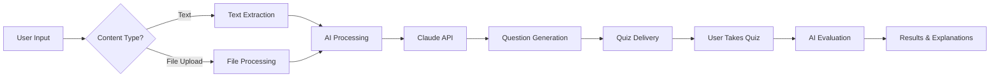

## Platform Architecture

inspir is built as a modern, performant web application with AI at its core.

### Technology Stack

<CardGroup cols={2}>
  <Card title="Frontend" icon="react">
    **React + Vite + Tailwind CSS**
    
    - React 19 for UI components
    - Vite for lightning-fast builds
    - Tailwind CSS for styling
    - React Router for navigation
    - Framer Motion for animations
  </Card>
  <Card title="Backend" icon="server">
    **Node.js + Express**
    
    - Express 5 API server
    - Multer for file uploads
    - Rate limiting for security
    - JWT authentication
    - RESTful API design
  </Card>
  <Card title="AI Engine" icon="brain">
    **Anthropic Claude**
    
    - Claude API for generation
    - Context-aware responses
    - Step-by-step explanations
    - Multi-modal support (text + images)
    - Intelligent question generation
  </Card>
  <Card title="Database & Auth" icon="database">
    **Supabase**
    
    - PostgreSQL database
    - Row Level Security (RLS)
    - Real-time subscriptions
    - User authentication
    - File storage
  </Card>
</CardGroup>

## How It Works: End-to-End

### 1. User Workflow



<Steps>
  <Step title="Content Input">
    Users can provide study material in multiple ways:

    **Text Input:**
    - Direct topic description ("Quiz me on World War 2")
    - Pasted notes, articles, or study guides
    - Any length from a sentence to thousands of words

    **File Upload:**
    ```javascript Upload Handler
    // Backend accepts TXT and DOCX files
    const allowedTypes = ['text/plain', 'application/vnd.openxmlformats-officedocument.wordprocessingml.document'];
    const maxSize = 10 * 1024 * 1024; // 10MB limit
    ```

    Files are processed using:
    - Plain text: Direct extraction
    - DOCX: `mammoth` library for document parsing
  </Step>

  <Step title="AI Processing">
    The backend sends content to Claude API with a structured prompt:

    ```javascript AI Request Flow
    // 1. Build context from user input
    const context = {
      topic: userTopic,
      content: extractedText || userNotes,
      sourceName: fileName || topic
    };

    // 2. Send to Claude API
    const response = await anthropic.messages.create({
      model: "claude-3-5-sonnet-20241022",
      max_tokens: 4096,
      messages: [{
        role: "user",
        content: promptTemplate(context)
      }]
    });

    // 3. Parse structured JSON response
    const quiz = JSON.parse(response.content[0].text);
    ```

    <Info>
      Claude generates questions that test **understanding**, not just memorization. It creates distractors (wrong answers) that address common misconceptions.
    </Info>
  </Step>

  <Step title="Question Generation">
    Claude generates a mix of question types:

    **Multiple Choice Questions (MCQs):**
    - 4 options (A, B, C, D)
    - One correct answer
    - Three plausible distractors
    - Detailed explanation for each

    **Short Answer Questions:**
    - Open-ended responses
    - Key concepts identified
    - Flexible evaluation

    Each quiz contains **10 questions** by default, optimized for:
    - Comprehensive topic coverage
    - 10-15 minute completion time
    - Balanced difficulty progression
  </Step>

  <Step title="Storage & Retrieval">
    Quiz data is stored in Supabase PostgreSQL:

    ```sql Database Schema
    -- Quizzes table
    CREATE TABLE quizzes (
      id UUID PRIMARY KEY DEFAULT uuid_generate_v4(),
      user_id UUID REFERENCES auth.users(id),
      source_name TEXT NOT NULL,
      questions JSONB NOT NULL,
      created_at TIMESTAMP DEFAULT NOW(),
      share_token TEXT UNIQUE
    );

    -- Quiz attempts table
    CREATE TABLE quiz_attempts (
      id UUID PRIMARY KEY DEFAULT uuid_generate_v4(),
      quiz_id UUID REFERENCES quizzes(id),
      user_id UUID REFERENCES auth.users(id),
      answers JSONB NOT NULL,
      score INTEGER NOT NULL,
      created_at TIMESTAMP DEFAULT NOW()
    );
    ```

    Benefits:
    - Users can review past quizzes anytime
    - Track progress over time
    - Share quizzes via unique tokens
    - View attempt history and statistics
  </Step>

  <Step title="Answer Evaluation">
    When users submit answers, the backend evaluates them:

    **MCQ Evaluation:**
    ```javascript
    // Simple letter comparison
    const isCorrect = userAnswer === correctAnswer;
    ```

    **Short Answer Evaluation:**
    ```javascript
    // AI-powered evaluation via Claude
    const evaluation = await anthropic.messages.create({
      model: "claude-3-5-sonnet-20241022",
      messages: [{
        role: "user",
        content: `Question: ${question}
Correct Answer: ${correctAnswer}
Student Answer: ${userAnswer}

Evaluate if the student answer demonstrates understanding.`
      }]
    });
    ```

    The AI:
    - Awards full credit for correct concepts
    - Gives partial credit for incomplete answers
    - Identifies what's missing or incorrect
    - Provides constructive feedback
  </Step>

  <Step title="Results & Learning">
    Results include:

    - **Score:** Percentage and fraction (e.g., 8/10 = 80%)
    - **Performance tier:** Excellent (90%+), Good (70-89%), Needs Improvement (below 70%)
    - **Question breakdown:**
      - User's answer
      - Correct answer
      - Detailed explanation
      - Key concepts tested
    - **Recommendations:** Suggested areas to review
  </Step>
</Steps>

## AI-Powered Features Deep Dive

### Quiz Generator

The core feature that powers active recall learning:

<Tabs>
  <Tab title="How It Works">
    1. **Content Analysis:** Claude analyzes your topic or uploaded materials
    2. **Concept Extraction:** Identifies key concepts worth testing
    3. **Question Generation:** Creates questions at appropriate difficulty
    4. **Distractor Creation:** Generates plausible wrong answers for MCQs
    5. **Explanation Generation:** Writes detailed explanations for learning

    ```javascript Example Quiz Structure
    {
      "sourceName": "American Revolution",
      "questions": [
        {
          "question": "What was the primary cause of the American Revolution?",
          "type": "multiple_choice",
          "options": [
            "Taxation without representation",
            "Religious persecution",
            "Land disputes with France",
            "Economic depression"
          ],
          "correct_answer": "A",
          "explanation": "The slogan 'no taxation without representation' became..."
        }
      ]
    }
    ```
  </Tab>
  <Tab title="Input Processing">
    The backend accepts multiple input formats:

    **Text Content:**
    - Minimum 10 characters
    - Maximum ~50,000 characters
    - Automatically chunked if needed

    **DOCX Processing:**
    ```javascript
    import mammoth from 'mammoth';

    const result = await mammoth.extractRawText({
      path: uploadedFile.path
    });
    const extractedText = result.value;
    ```

    **TXT Processing:**
    ```javascript
    import fs from 'fs';

    const extractedText = fs.readFileSync(
      uploadedFile.path, 
      'utf-8'
    );
    ```
  </Tab>
  <Tab title="Rate Limiting">
    To ensure fair usage and prevent abuse:

    ```javascript Rate Limits
    // Quiz generation: 10 per hour per IP
    const quizGenerationLimiter = rateLimit({
      windowMs: 60 * 60 * 1000, // 1 hour
      max: 10,
      message: 'Too many quiz generation requests'
    });

    // Quiz submission: 30 per hour per IP
    const quizSubmissionLimiter = rateLimit({
      windowMs: 60 * 60 * 1000,
      max: 30,
      message: 'Too many quiz submissions'
    });
    ```

    Authenticated users get higher limits.
  </Tab>
</Tabs>

### Doubt Solver

Instant AI-powered homework help:

<AccordionGroup>
  <Accordion title="Text Questions">
    Users can type any question and get step-by-step solutions.

    **Flow:**
    1. User types question + optional subject
    2. Backend sends to Claude with specialized prompt
    3. Claude returns:
       - Step-by-step solution
       - Key concepts involved
       - Estimated difficulty
    4. Solution saved to database (if authenticated)
    5. User can share solution via unique link

    **Example Response:**
    ```json
    {
      "question_text": "Solve x² + 5x + 6 = 0",
      "subject": "Mathematics",
      "solution_steps": [
        "Factor the quadratic equation: (x + 2)(x + 3) = 0",
        "Set each factor equal to zero: x + 2 = 0 or x + 3 = 0",
        "Solve for x: x = -2 or x = -3"
      ],
      "key_concepts": ["Factoring", "Zero Product Property"],
      "estimated_difficulty": "Easy"
    }
    ```
  </Accordion>

  <Accordion title="Image Upload + OCR">
    Users can upload photos of handwritten or printed problems.

    **Multi-Modal Processing:**
    ```javascript
    // 1. User uploads image (JPG, PNG, HEIC)
    // 2. Convert to base64
    const base64Image = fs.readFileSync(file.path, 'base64');

    // 3. Send to Claude Vision API
    const response = await anthropic.messages.create({
      model: "claude-3-5-sonnet-20241022",
      messages: [{
        role: "user",
        content: [
          {
            type: "image",
            source: {
              type: "base64",
              media_type: "image/jpeg",
              data: base64Image
            }
          },
          {
            type: "text",
            text: "Extract and solve this problem"
          }
        ]
      }]
    });
    ```

    Claude can:
    - Read handwritten text
    - Parse mathematical notation
    - Understand diagrams and figures
    - Detect subject area automatically
  </Accordion>

  <Accordion title="Sharing & History">
    **For Authenticated Users:**
    - All solved doubts saved automatically
    - Access history from profile
    - Share solutions via link
    - Delete old doubts

    **Share Links:**
    ```javascript
    // Generate unique share token
    const shareToken = uuidv4();
    const shareUrl = `https://quiz.inspir.uk/doubt/shared/${shareToken}`;

    // Anyone with link can view solution
    // No account required
    ```
  </Accordion>
</AccordionGroup>

### Other AI Features

<CardGroup cols={2}>
  <Card title="Flashcard Creator" icon="cards-blank">
    - Upload notes → AI generates Q&A flashcards
    - Spaced repetition algorithm
    - Track mastery per card
    - Export as PDF or print
  </Card>
  <Card title="Text Summarizer" icon="file-lines">
    - Paste long text → get concise summary
    - Adjustable summary length
    - Bullet points or paragraph format
    - Preserves key information
  </Card>
  <Card title="Study Guide Generator" icon="book">
    - Upload materials → comprehensive guide
    - Organized by topics
    - Key terms and definitions
    - Practice questions included
  </Card>
  <Card title="Math Solver" icon="calculator">
    - Solve equations step-by-step
    - Show work and reasoning
    - Support for algebra, calculus, etc.
    - Graph visualizations
  </Card>
</CardGroup>

## Gamification System

Building lasting study habits through motivation:

### Study Streaks

```javascript Streak Tracking
// Users earn streaks by studying daily
// Streak increments when user:
// - Completes a quiz
// - Solves a doubt
// - Creates flashcards
// - Uses any learning tool

const updateStreak = async (userId) => {
  const lastActivity = await getLastActivity(userId);
  const today = new Date();
  
  if (isConsecutiveDay(lastActivity, today)) {
    await incrementStreak(userId);
  } else if (!isSameDay(lastActivity, today)) {
    await resetStreak(userId);
  }
};
```

**Streak Benefits:**
- Visual 🔥 flame icon grows with streak length
- Leaderboard ranking based on streaks
- Badges awarded at milestones (7 days, 30 days, 100 days)
- Streak recovery: Miss 1 day? Use a streak freeze (earned every 7 days)

### XP & Leveling

```sql XP System
-- Users earn XP for actions:
CREATE TABLE xp_events (
  action TEXT,
  xp_reward INTEGER
);

INSERT INTO xp_events VALUES
  ('quiz_completed', 10),
  ('quiz_perfect', 25),
  ('doubt_solved', 15),
  ('flashcard_set_completed', 20),
  ('daily_goal_met', 30),
  ('streak_milestone', 50);
```

**Levels:**
- Level 1: 0 XP (Beginner)
- Level 2: 100 XP (Apprentice)
- Level 3: 250 XP (Scholar)
- Level 4: 500 XP (Expert)
- Level 5+: Exponential scaling

Each level unlocks new badges and profile customizations.

### Leaderboards

- **Global:** Top users by XP
- **Weekly:** Most active this week
- **Streaks:** Longest current streaks
- **Category:** Top in each subject area

## Security & Privacy

<Warning>
  **Your data is secure:** inspir uses industry-standard security practices to protect your information.
</Warning>

### Authentication

```javascript
// JWT-based authentication
import jwt from 'jsonwebtoken';

const token = jwt.sign(
  { userId, email },
  process.env.JWT_SECRET,
  { expiresIn: '7d' }
);
```

- Passwords hashed with bcrypt (10 salt rounds)
- JWT tokens expire after 7 days
- Refresh tokens for extended sessions
- Supabase Auth for OAuth providers

### Data Protection

- **Row Level Security (RLS):** Users can only access their own data
- **HTTPS Only:** All communication encrypted
- **Rate Limiting:** Prevents abuse and DDoS
- **Input Validation:** All user input sanitized
- **File Upload Security:** Type and size validation

### Privacy

- **No tracking cookies:** Only essential cookies for authentication
- **Data deletion:** Users can delete account + all data
- **Content privacy:** Study materials never shared without permission
- **AI processing:** Content sent to Claude API is not used for training

## Performance Optimizations

<Tabs>
  <Tab title="Frontend">
    - **Code splitting:** Route-based lazy loading
    - **Asset optimization:** Minified JS/CSS bundles
    - **Image optimization:** Lazy loading, responsive images
    - **Caching:** Service worker for offline support
    - **CDN delivery:** Static assets served via CDN
  </Tab>
  <Tab title="Backend">
    - **Database indexing:** Optimized queries on user_id, created_at
    - **Connection pooling:** Supabase manages DB connections
    - **Compression:** gzip for API responses
    - **Rate limiting:** Prevents server overload
    - **Async processing:** Non-blocking file uploads
  </Tab>
  <Tab title="AI">
    - **Prompt caching:** Reuse system prompts
    - **Timeout handling:** 120s timeout for generation
    - **Error recovery:** Retry logic for API failures
    - **Response streaming:** Stream Claude responses for faster UX
  </Tab>
</Tabs>

## Developer Resources

The inspir codebase is available for reference:

```bash Local Development
# Backend
cd backend
cp .env.example .env
npm install
npm run dev

# Frontend
cd frontend
cp .env.example .env
npm install
npm run dev
```

**Environment Variables Required:**
```bash
# Backend .env
ANTHROPIC_API_KEY=your_claude_api_key
SUPABASE_URL=your_supabase_url
SUPABASE_ANON_KEY=your_supabase_anon_key
SUPABASE_SERVICE_ROLE_KEY=your_service_role_key
JWT_SECRET=your_jwt_secret_min_32_chars
FRONTEND_URL=http://localhost:5173

# Frontend .env
VITE_API_URL=http://localhost:3000
VITE_SUPABASE_URL=your_supabase_url
VITE_SUPABASE_ANON_KEY=your_supabase_anon_key
```

## What's Next?

<CardGroup cols={2}>
  <Card
    title="Try It Now"
    icon="rocket"
    href="https://quiz.inspir.uk"
  >
    Start using inspir today—no credit card required
  </Card>
  <Card
    title="Quickstart Guide"
    icon="book-open"
    href="/quickstart"
  >
    Generate your first quiz in 2 minutes
  </Card>
</CardGroup>